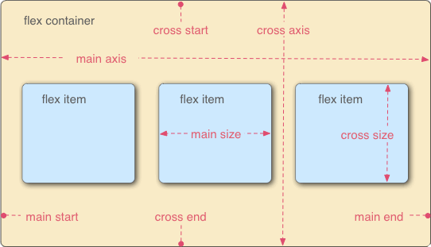
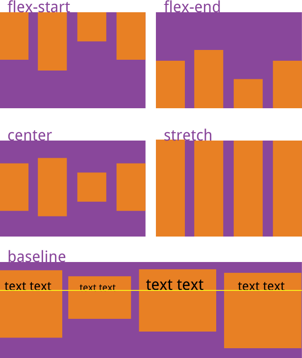
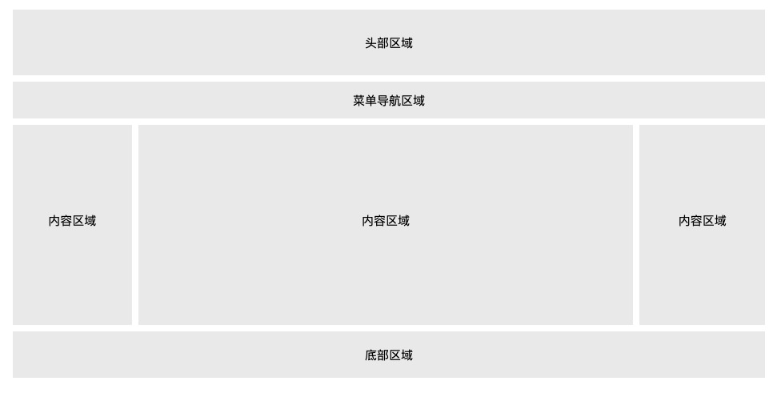

# CSS学习笔记
<!-- TOC -->

- [CSS学习笔记](#css学习笔记)
  - [CS语法规则](#cs语法规则)
    - [普通规则](#普通规则)
    - [@规则](#规则)
      - [常规规则](#常规规则)
        - [@charset](#charset)
      - [@import](#import)
      - [@namespace](#namespace)
    - [嵌套规则](#嵌套规则)
  - [@media媒体查询](#media媒体查询)
    - [媒体类型](#媒体类型)
    - [媒体特性](#媒体特性)
    - [逻辑操作符](#逻辑操作符)
    - [定义媒体查询](#定义媒体查询)
      - [@media方法](#media方法)
      - [@import方法](#import方法)
      - [html外部引入](#html外部引入)
  - [CSS选择器](#css选择器)
    - [基本选择器](#基本选择器)
      - [通用选择器](#通用选择器)
      - [标签选择器](#标签选择器)
      - [ID选择器](#id选择器)
      - [类选择器](#类选择器)
    - [高级选择器](#高级选择器)
      - [后代选择器](#后代选择器)
      - [子代选择器](#子代选择器)
      - [相邻选择器](#相邻选择器)
      - [通用相邻选择器](#通用相邻选择器)
      - [分组选择器](#分组选择器)
      - [属性选择器](#属性选择器)
    - [伪类选择器](#伪类选择器)
    - [伪元素](#伪元素)
      - [伪元素 ::after](#伪元素-after)
      - [伪元素::first-letter](#伪元素first-letter)
      - [伪元素 ::first-line](#伪元素-first-line)
      - [伪元素 ::selection](#伪元素-selection)
      - [伪元素 ::placeholder](#伪元素-placeholder)
  - [HTML引用CSS方法](#html引用css方法)
    - [内嵌样式](#内嵌样式)
    - [内联样式](#内联样式)
    - [外部样式](#外部样式)
    - [导入样式](#导入样式)
  - [CSS长度单位](#css长度单位)
    - [相对长度单位](#相对长度单位)
    - [绝对长度单位](#绝对长度单位)
  - [CSS属性：文本、字体、颜色、背景、链接、鼠标](#css属性文本字体颜色背景链接鼠标)
    - [文本样式](#文本样式)
    - [字体样式(font)](#字体样式font)
      - [font-family：设置字体](#font-family设置字体)
      - [font-style：设置字体的风格，例如倾斜、斜体](#font-style设置字体的风格例如倾斜斜体)
      - [font-weight：设置字体粗细](#font-weight设置字体粗细)
      - [font-size：设置字体尺寸](#font-size设置字体尺寸)
      - [font-variant：将小写字母转换为小型大写字母](#font-variant将小写字母转换为小型大写字母)
      - [font：字体属性的缩写，可以在一个声明中设置多个字体属性](#font字体属性的缩写可以在一个声明中设置多个字体属性)
      - [颜色样式](#颜色样式)
    - [背景样式](#背景样式)
      - [background-color：设置元素的背景颜色](#background-color设置元素的背景颜色)
      - [background-image：设置元素的背景图像](#background-image设置元素的背景图像)
      - [background-repeat：控制背景图像是否重复](#background-repeat控制背景图像是否重复)
      - [background-attachment：控制背景图像是否跟随窗口滚动](#background-attachment控制背景图像是否跟随窗口滚动)
      - [background-position：控制背景图像在元素中的位置](#background-position控制背景图像在元素中的位置)
      - [background-origin：设置 background-position 属性相对于什么位置来定位背景图像](#background-origin设置-background-position-属性相对于什么位置来定位背景图像)
      - [background-size：设置背景图像的尺寸](#background-size设置背景图像的尺寸)
      - [background-clip：设置背景图像的显示区域](#background-clip设置背景图像的显示区域)
      - [background：背景属性的缩写，可以在一个声明中设置所有的背景属性](#background背景属性的缩写可以在一个声明中设置所有的背景属性)
    - [链接样式](#链接样式)
    - [鼠标样式](#鼠标样式)
    - [精灵图](#精灵图)
  - [CSS属性：盒子模型](#css属性盒子模型)
    - [内容区（content）](#内容区content)
    - [边框](#边框)
      - [border-style：设置边框的样式，例如实线、虚线等](#border-style设置边框的样式例如实线虚线等)
      - [border-width：设置边框的宽度（厚度）](#border-width设置边框的宽度厚度)
      - [border-color：设置边框的颜色](#border-color设置边框的颜色)
      - [border：上面三个边框属性的缩写](#border上面三个边框属性的缩写)
    - [边框图片 border-image](#边框图片-border-image)
      - [border-image-source 定义边框图像的路径](#border-image-source-定义边框图像的路径)
      - [border-image-slice 分割图像](#border-image-slice-分割图像)
      - [border-image-width 设置图像宽度](#border-image-width-设置图像宽度)
      - [border-image-outset](#border-image-outset)
      - [border-image-repeat](#border-image-repeat)
    - [外边距(margin)](#外边距margin)
      - [外边距设置](#外边距设置)
      - [外边距折叠](#外边距折叠)
    - [内边距（padding）](#内边距padding)
    - [宽度和高度](#宽度和高度)
      - [width 设置元素内容区的宽度](#width-设置元素内容区的宽度)
      - [height 定义元素内容区的高度](#height-定义元素内容区的高度)
      - [max-width 和 max-height 设置元素内容区的最大宽度和最大高度](#max-width-和-max-height-设置元素内容区的最大宽度和最大高度)
      - [min-width 和 min-height 设置元素内容区的最小宽度和最小高度](#min-width-和-min-height-设置元素内容区的最小宽度和最小高度)
    - [轮廓](#轮廓)
      - [outline-color 设置轮廓的颜色](#outline-color-设置轮廓的颜色)
      - [outline-style 设置轮廓得样式](#outline-style-设置轮廓得样式)
      - [outline-width 设置轮廓的宽度](#outline-width-设置轮廓的宽度)
      - [outline](#outline)
      - [outline-offset](#outline-offset)
    - [盒子阴影（box-shadow）](#盒子阴影box-shadow)
    - [圆角（border-radius）](#圆角border-radius)
    - [box-sizing：设置盒子模型大小](#box-sizing设置盒子模型大小)
    - [resize调整元素大小](#resize调整元素大小)
  - [CSS属性：布局](#css属性布局)
    - [可见性(visibility)](#可见性visibility)
    - [显示类型(display)](#显示类型display)
    - [定位(position)](#定位position)
      - [static](#static)
      - [relative](#relative)
      - [absolute 绝对定位](#absolute-绝对定位)
      - [fixed 固定定位](#fixed-固定定位)
      - [粘性定位：sticky](#粘性定位sticky)
    - [浮动(float)布局](#浮动float布局)
    - [多列布局column](#多列布局column)
    - [弹性布局(弹性盒子)flex](#弹性布局弹性盒子flex)
      - [容器属性](#容器属性)
        - [flex-direction](#flex-direction)
        - [flex-wrap](#flex-wrap)
        - [flex-flow](#flex-flow)
        - [justify-content](#justify-content)
        - [align-items](#align-items)
        - [align-content](#align-content)
      - [元素属性](#元素属性)
        - [order](#order)
        - [align-self](#align-self)
        - [flex](#flex)
  - [网页布局](#网页布局)
    - [头部区域](#头部区域)
    - [菜单导航区域](#菜单导航区域)
    - [内容区域](#内容区域)
    - [底部区域](#底部区域)

<!-- /TOC -->
## CS语法规则

### 普通规则

有三部分构成：

- 选择器
- 属性
- 值

```css
选择器{
    属性：值;
}
```

### @规则

以@开头后面跟随一个关键字的形式构成，根据使用方法的不同又可以分为“常规规则”与“嵌套规则”两种。

#### 常规规则

语句结构为

```css
@keyword rule
```

##### @charset

 用来设置 CSS 文件使用的字符编码，语法格式如下：

 ```css
@charset "编码方式名称"; /*默认值为“utf-8”。*/
```

在使用时需要注意以下几点：

- 如果设置 @charset 的话，那么它必须出现在 CSS 文件的最前面，@charset 之前不能出现任何字符；
- 字符编码需要使用双引号""包裹起来；
- @规则名称（@charset）与具体的字符编码之间需要使用一个空格分隔；
- 规则后面的分号不能省略；
如果设置多个 @charset，那么只有第一个声明有效；
- 不能在 HTML 元素或者 `<style>` 标签中使用 @charset；
- 如果以不同的方式定义了多种字符编码规则，它们的优先级顺序如下：
HTML 文件开头的字符编码声明；
HTTP 请求头中的字符编码声明；
CSS 文件中使用 @charset 定义的字符编码声明；
- `<link>` 标签中 charset 属性设置的字符编码声明（HTML5 中已废弃）。

#### @import

用来向当前 CSS 样式文件中导入其它样式文件。通过 @import 可以引入其他样式表文件中除 @charset 以外的所有内容，另外 @import 也必须放在样式文件的最前面。

语法格式如下：

```css
@import url("css文件路径");
```

#### @namespace

@namespace 用来定义 CSS 样式表中 XML 命名空间的 @规则

### 嵌套规则

在 @规则后面需要跟随一个花括号{ }，其中包含了一些其它的规则声明，语句格式如下：

```css
@keyword {
  /*样式规则*/
}
```

## @media媒体查询

媒体查询是根据不同的媒体类型（设备类型）和条件来区分各种设备（例如：电脑、手机、平板电脑、盲文设备等），并为它们分别定义不同的 CSS 样式。媒体查询能让 CSS 可以更精确的作用于不同的设备或同一设备的不同条件，让所有用户都能得到很好的用户体验。

### 媒体类型

媒体类型用来表示设备的类别，CSS 中提供了一些关键字来表示不同的媒体类型，如下表所示：

媒体类型| 描述
---|---
all |表示所有的媒体设备
handheld |表示小型手持设备，如手机、平板电脑
projection| 表示投影设备
screen |表示电脑显示器
tv |表示电视机类型的设备

### 媒体特性

除了具体的类型外，还可以通过一些属性来描述设备的具体特征，例如宽度、高度、分辨率等，如下表所示：


### 逻辑操作符

逻辑操作符包含 not、and 和 only 三个，通过逻辑操作符可以构建复杂的媒体查询，还可以通过逗号来分隔多个媒体查询，将它们组合为一个规则。

- and：用于将多个媒体查询组合成一条媒体查询，当每个查询规则都为真时则该条媒体查询为真，另外通过 and 操作符还可以将媒体特性与媒体类型结合在一起；
- not：用于否定媒体查询，当查询规则不为真时则返回 true，否则返回 false。如果使用 not 操作符，则还必须指定媒体类型；
- only：仅在整个查询匹配时才会生效，当不使用 only 时，旧版的浏览器会将 screen and (max-width: 500px) 简单地解释为 screen，忽略查询的其余部分，并将样式应用于所有屏幕。 如果使用 only 运算符，则还必须指定媒体类型。

### 定义媒体查询

通过以下两种方式来定义媒体查询：

- 使用 @media 或 @import 规则在样式表中指定对应的设备类型；
- 用 media 属性在 `<style>、<link>、<source>`或其他 HTML 元素中指定特定的设备类型。

#### @media方法

@media 可以指定一组媒体查询和一个 CSS 样式块，当且仅当媒体查询与正在使用的设备匹配时，指定的 CSS 样式才会应用于文档

```css
/* 在小于或等于 992 像素的屏幕上，将背景色设置为蓝色 */
@media screen and (max-width: 992px) {
  body {
    background-color: blue;
  }
}
```

#### @import方法

用来导入指定的外部样式文件并指定目标的媒体类型

```css
@import url("css/screen.css") screen;   /* 引入外部样式，该样式仅会应用于电脑显示器 */
@import url("css/print.css") print;     /* 引入外部样式，该样式仅会应用于打印设备 */
```

#### html外部引入

在html文件里外部引入css文件时，可以针对不同的媒体使用不同的样式表：

```html
<link rel="stylesheet" media="mediatype and|not|only (expressions)" href="print.css">
```

## CSS选择器

选择器由 HTML 标签的 id、class 属性或标签本身以及一些特殊符号构成，用来指定要为哪个 HTML 元素定义样式。

### 基本选择器

#### 通用选择器

选择器用星号`*`表示，匹配 HTML 文档中的每个元素。在开发中，我们通常使用通用选择器来清除 HTML 元素中默认的内外边距。

```css
*{
    margin: 0 auto;
    padding:0;
}
```

#### 标签选择器

通过具体的标签名称来匹配文档内<font color='red'>所有同类</font>的标签

```css
标签名{
    属性：值;
}
```

#### ID选择器

用来匹配 HTML 文档中具有<font color='red'>指定 ID 属性的标签</font>，ID 选择器的定义需要用到`#`号，后面紧跟 ID 属性的值

```css
#id值{
    属性：值;
}
```

#### 类选择器

用来匹配 HTML 文档中具有<font color='red'>指定 class 属性的所有标签</font>，选择器的定义需要用到一个英文的句号`.`，后面紧跟 class 属性的值。

```css
.class值{
    属性：值
}
```

又由于html里 class 属性可以不是唯一的，并且可以应用于不同类型的标签，因此还可以在定义类选择器时指定具体类型的标签`标签名.class属性值`

### 高级选择器

#### 后代选择器

一个标签2嵌套在一个标签1内部的时候，就可以将这个标签看1作是标签2的后代。

后代选择器的定义方式就是将`标签名、class 属性或 id 属性`等按照标签的嵌套关系由外到内的依次罗列，中间使用空格分开

```css
ul li a {
    text-decoration: none;
}
```

#### 子代选择器

子选择器与后代选择器类似，<font color='red'>不过子选择器只会匹配某个元素的直接后代</font>（元素与其子元素之间只有一层嵌套关系）。

子选择器由两个或多个选择器组成，选择器之间用大于号>分隔开：

```css
p>strong{
    color:red;
}
```

#### 相邻选择器

用来匹配某个元素<font color='red'>之后紧邻</font>的另一个元素，这两个元素拥有同一个父级元素并且不存在嵌套关系。

邻兄弟选择器的定义需要用到加号+，加号两边为相邻的两个元素。

```css
/*
h1 + p选择器会匹配同一父级下紧邻<h1>标签并在其后的<p>标签
*/
h1 + p {
    color: blue;
    font-size: 18px;
}
/*
ul.task + p选择器则会匹配同一父级下紧邻<ul>标签并在其后的<p>标签，
但<ul>要具有class="task"属性。
*/
ul.task + p {
    color: #f0f;
    text-indent: 30px;
}
```

#### 通用相邻选择器

用来匹配某个元素<font color='red'>之后</font>的另一个元素，<font color='red'>无需紧邻</font>，这两个元素拥有同一个父级元素并且不存在嵌套关系。

定义需要用到波浪号`~`，波浪号两边为同一父级元素下的两个元素，选择器会匹配波浪号后面的元素，如下所示：

```css
/*
h1 ∼ p选择器会匹配同一父级元素下<h1>标签之后的所用<p>标签。
*/
h1 ∼ p {
    color: blue;
    font-size: 18px;
}
```

#### 分组选择器

分组选择器可以将<font color='red'>同样的样式规则应用到多个选择器</font>中，每个选择器之间使用逗号`,`进行分隔，这么做可以避免定义重复的样式规则，最大程度地减少 CSS 样式表中的代码。

```css
/*
选择器h1、h2、h3中包含相同的样式font-weight: normal;
*/
h1, h2, h3 {
    font-weight: normal;
}
```

#### 属性选择器

用来匹配具有特定属性的元素。

属性选择器的定义方式与标签选择器相似，只不过需要在标签的后面使用方括号`[ ]`来指定标签具有的属性信息

``` css
/*
input[type="text"]选择器会匹配所有具有type="text"属性的<input>标签。

*/
input[type="text"] {
   color: blue;
}
```

方括号[ ]内的属性信息还支持以下几种写法：

- [target]：选择所有带有target属性元素；
- [target=_blank]：选择所有具有target="_blank" 属性的元素；
- [title~=flower]：选择title属性包含单词“flower”的所有元素；
- [lang|=en]：选择lang属性正好是“en”或以“en”为开头的所有元素。

### 伪类选择器

伪类是 W3C 制定的一套选择器的特殊状态，通过伪类可以设置元素的动态状态，例如悬停（hover）、点击（active）以及文档中不能通过其它选择器选择的元素（这些元素没有 ID 或 class 属性），例如第一个子元素（first-child）或者最后一个子元素（last-child）。

伪类的名称不区分大小写，但需要以冒号`:`开头。另外，伪类需要与 CSS 中的选择器结合使用，语法格式如下：

```css
selector:pseudo-class {
    property: value;
}
```

`selector`为选择器名称，`pseudo`为伪类的名称


### 伪元素

伪元素是一个附加在选择器末尾的关键词，通过伪元素不需要借助元素的 ID 或 class 属性就可以对被选择元素的特定部分定义样式。例如通过伪元素可以设置段落中第一个字母的样式，或者在元素之前、之后插入一些内容等等。

在 CSS3 中，将伪元素单冒号的使用方法改为了使用双冒号`::`，以此来区分伪类和伪元素。

```css
selector::pseudo-element {
    property: value;
}
```

>注意：一个选择器中只能使用一个伪元素，而且伪元素必须紧跟在选择器之后。按照最新的 W3C 规范，在定义伪元素时您应该使用双冒号::而不是单个冒号:，以便区分伪类和伪元素。但由于旧版本的 W3C 规范并未对此进行特别区分，因此目前绝大多数的浏览器都同时支持使用单冒号和双冒号两种方式来定义伪元素。

CSS 中提供了一系列的伪元素，如下表所示：

伪元素| 例子| 例子描述
---|---|---
::after| p::after| 在每个 `<p>` 元素之后插入内容
::before| p::before| 在每个` <p> `元素之前插入内容
::first-letter| p::first-letter| 匹配每个 `<p>`元素中内容的首字母
::first-line| p::first-line| 匹配每个 `<p>` 元素中内容的首行
::selection| p::selection| 匹配用户选择的元素部分
::placeholder| input::placeholder| 匹配每个表单输入框（例如`<input>`）的 placeholder 属性

#### 伪元素 ::after

能够在指定元素的后面插入一些内容，在 ::after 中需要使用 content 属性来定义要追加的内容，而且在 ::after 中必须定义 content 属性才会生效（没有需要插入的内容时可以将 content 属性的值定义为空""）。

```css
p.two::after {
            content:"要插入的内容";
            color: red;
            font-size: 6px;}
```

#### 伪元素::first-letter

用来设置指定元素中内容第一个字符的样式，通常用来配合 font-size 和 float 属性制作首字下沉效果。需要注意的是，伪元素 ::first-letter 仅可以用于块级元素，行内元素想要使用该伪元素，则需要先将其转换为块级元素。

#### 伪元素 ::first-line

用来设置指定元素中内容第一行的样式，与 ::first-letter 类似，伪元素 ::first-line 也仅可以用于块级元素，行内元素想要使用该伪元素，则需要先将其转换为块级元素。

#### 伪元素 ::selection

用来设置对象被选中时的样式，需要注意的是，伪元素 ::selection 中只能定义元素被选中时的 color、background、cursor、outline 以及 text-shadow（IE11 尚不支持定义该属性）等属性。

#### 伪元素 ::placeholder

用来设置表单元素（`<input>、<textarea>`元素）的占位文本（通过 HTML 的 placeholder 属性设置的文本）

```css
input.text::placeholder{
            color: red;
            background-color: #CCC;
        }
```


## HTML引用CSS方法

### 内嵌样式

在HTML文件`<head>`标签内的`<style>`标签中定义CSS样式。

```html
<!DOCTYPE html>
<html>
    <head>
        <title>编程帮</title>
        <style>
            /*
            定义CSS样式
            */
            body {
                background-color: linen;
            }
            h1 {
                color: maroon;
                margin-left: 40px;
            }
        </style>
    </head>  
    <body>
        <h1>编程帮</h1>
        <p>http://www.biancheng.net/</p>
    </body>
</html>
```

### 内联样式

将CSS样式定义在HTML的标签`style`属性中。

由于内联样式定义在标签内部，所以它只对所在的标签有效。

内联样式虽然可以很方便的为 HTML 标签赋予 CSS 样式，但它的缺点也非常明显，不推荐过多使用。

>- 定义内联样式需要在每个 HTML 标签中定义 style 属性，很不方便；
>- 在内联样式中定义的样式不能再其它任何地方重用；
>- 内联样式在后期维护时很不方便，因为一个网站通常有很多页面组成，当修改页面样式时需要对页面逐个修改；
>- 添加过多的内联样式会导致 HTML 文档的体积增大。

```html
<!DOCTYPE html>
<html>
    <head>
        <title>编程帮</title>
    </head>  
    <body>
        /*
        定义了h1和p两个标签的样式
        */
        <h1 style="color: maroon; margin-left: 40px">编程帮</h1>
        <p style="color: blue;">http://www.biancheng.net/</p>
    </body>
</html>
```

### 外部样式

外部样式表是<font color='red'>最推荐的</font>引用 CSS 的方式.

只需要将 CSS 样式定义在一个 .css 格式的文件中，然后在HTML 的头部使用`<link>`标签将这个 .css 格式的样式文件应用到 HTML 文档中。

`<link>href="css文件地址" type="连接文档的类型" rel="定义链接外部文件的关联类型" </link>`

```html
<html>
  <head>
    <meta charset="utf-8">
    <title></title>
    <link href="lianjie.css" type="text/css" rel="stylesheet" />
    <link href="lianjie-2.css" type="text/css" rel="stylesheet" />
  </head>
  <body>
  </body>
</html>
```

### 导入样式

在HTML文件的头部`<style>`标签内使用@import来引用外部样式表，语法格式为

```html
<style>
    @import "CSS文件地址"
</style>
```

## CSS长度单位

设置某些属性值时可能会涉及到与值对应的单位，根据类型的不同可以分为两类，分别是绝对长度单位（例如英寸、厘米、点）和相对长度单位（例如百分比）。

### 相对长度单位

相对长度单位指的是这个单位没有一个固定的值，它的值受到其它元素属性（例如浏览器窗口的大小、父级元素的大小）的影响，在响应式布局方面相对长度单位非常适用。

|单位|描述|实例|
---|---|---
em|相对于自身 font-size（字体大小）属性的值，如果自身没有设置，则继承父元素 font-size 属性的值，1em 等同于 font-size 属性值|p{line-height:2em;}
rem|相对于根元素<html>的 font-size 属性的大小|p{font-size: 1.2rem;}
ex|相对于所用字体中小写英文字母 x 的高度，若无法确定 x 的高度则使用 0.5em 计算|p{font-size: 1ex;}
ch|相对于所用字体中数字 0 的高度，若无法确定 0 的高度则使用 0.5em 计算|p{line-height: 3ch}
vw|相对于浏览器宽度，1vw=1%|p{font-size: 5vw;}
vh|相对于浏览器的高度，1vh = 窗口高度的 1%|p{font-size: 5vh;}
vmin|w 与 vh 中较小的值|p{font-size: 5vmin;}
vmax|vw 与 vh 中较大的值|p{font-size: 5vmax;}
%|相对于父元素的宽度或高度百分比|div{width: 55%}

### 绝对长度单位

绝对长度单位表示一个真实的物理尺寸，它的大小是固定的，不会因为其它元素尺寸的变化而变化。

单位|描述
---|---
cm|厘米
mm|毫米
in|英寸（1in = 96px = 2.54cm）
px|像素(1px = 1/96in）
pt|磅(1pt = 1/72in）
pc|派卡（1pc = 12pt)

## CSS属性：文本、字体、颜色、背景、链接、鼠标

### 文本样式

>- text-align：设置文本的水平对齐方式；
>- text-decoration：设置文本的装饰；
>- text-transform：设置文本中英文的大小写转换方式；
>- text-indent：设置文本的缩进方式；
>- line-height：设置行高；
>- letter-spacing：设置字符间距；
>- word-spacing：设置单词与单词之间的间距（对中文无效）；
>- text-shadow：设置文本阴影；
>- vertical-align：设置文本的垂直对齐方式；
>- white-space：设置文本中空白的处理方式；
>- direction：设置文本方向。

通过 CSS 中的文本属性可以像操作 Word 文档那样定义网页中文本的字符间距、对齐方式、缩进等

属性|描述|值
---|---|---
text-align|水平对齐方式|<p>1. left 默认值 左对齐</p><p>2.right 右对齐</p><p>3.center 居中对齐</p><p>4.justify 居中对齐</p><p>5.inherit 从父元素继承`text-align`属性值</p>
vertical-align|垂直对齐方式|<p>1.baseline 默认值，将元素的基线与父元素的基线对齐</p><p>2.sub 下标对齐，将元素的基线相对于父元素的基线降低</p><p>3.super 上标对齐，将元素的基线相对于父元素的基线升高</p><p>4.top 顶部对齐，将元素行内框的顶端与行框的顶端对齐</p><p>5.text-top 文本顶部对齐，把元素的顶端与父元素字体的顶端对齐</p><p>6.middle 居中对齐，通常使用在图片上，将图片垂直方向的中线与文本的中线（文字元素行内框的中线）对齐</p><p>7.bottom 底部对齐，将元素行内框的顶端与行框的底端对齐</p><p>8.length 以数字加单位的形式设置元素基线距离父元素基线的距离（可以为负值）</p><p>9.length 以数字加单位的形式设置元素基线距离父元素基线的距离（可以为负值</p><p>10.% 使用 "line-height" 属性的百分比值来排列此元素，允许使用负值</p><p>11.nherit 从父元素继承 vertical-align 属性的值</p>
text-decoration|设置或删除文本装饰|<p>1.none 默认值，标准文本，没有额外装饰，可以用来删除已有的文本装饰</p><p>2.underline 在文本下方添加一条下滑线</p><p>3.overline在文本上方添加一条上滑线</p><p>4.line-through在文本中间定义一条线，类似于删除线</p><p>5.inherit从父元素继承 text-decoration 属</p>
text-transform|来控制文本中英文字母的大小写|<p>1.none 默认值，对原文不做更改</p><p>2. capitalize将文本中的每个单词更改为以大写字母开头的形式</p><p>3.uppercase将文本中的英文字母全部更改为大写</p><p>4.lowercase将文本中英文字母全部变更为小写</p><p>5.inherit 继承父类元素属性值</p>
text-indent|首行缩进|<p>1.固定长度&emsp;以固定的值加单位的形式（例如 2em）定义缩进距离，默认值为 0</p><p>2.相对长度 &emsp;以基于父元素宽度的百分比来定义缩进距离</p><p>3. inherit 继承父类元素属性值</p>
line-height|行高|<p>1.normal默认值</p><p>2.number以具体的数字设置行高，这个数字会与当前的字体大小相乘，并将得到的值设置为行高</p><p>3.length以数字加单位的形式设置固定的行高</p><p>4.%以百分比的形式设置基于当前字体尺寸百分比的行高</p><p>5.inherit从父元素继承 line-height 属性的值</p>
letter-spacing|设置字符间的间距|<p>1.normal 默认值</p><p>2.length固定长度设置间距</p><p>3.inherit从父标签继承</p>
word-spacing|设置单次之间的间距，对中文无效|<p>1.normal 默认值</p><p>2.length固定长度设置间距</p><p>3.inherit从父标签继承</p>
text-shadow|为文本添加阴影及模糊效果|语句格式：<p><code>text-shadow: h-shadow v-shadow blur color;</code></p><p>h-shadow：必填值，设置阴影的水平位置，允许为负值</p><p>v-shadow：必填值，设置阴影的垂直位置，允许为负值；</p><p>blur：可选值，设置模糊的距离；</p><p>color：可选值，设置阴影的颜色</p>
white-space|设置如何处理元素内的空白|<p>1.normal 默认值，忽略文本中的空白</p><p>2.pre  保留文本中的空白，类似于`<pre>`标签的效果</p><p>3.nowrap 文本会在一行中显示，不会自动换行，直到遇到`<br>`标签为止</p><p>4.pre-wrap 保留文本中的空白，但是正常地进行换行</p><p>5.pre-line 合并文本中的空白，但是保留换行符</p><p>6.inherit 从父元素继承 white-space 属性的值</p>
direction|设置文本的方向|<p>1.ltr 默认值，文本按从左到右的方向输出</p><p>2.rtl 文本按从右到左的方向输出</p><p>3.inherit 从父元素继承 direction 属性的值</p>

### 字体样式(font)

#### font-family：设置字体

值|描述
---|---
family-name、generic-family|family-name：字体名称；generic-family：字体族，也就是某种类型的字体组合。字体的默认值取决于浏览器设置
inherit|从父元素继承字体的设置
>在网页设计中最常用的字体族是 serif 和 sans-serif，因为它们适合阅读。在显示一些程序代码是通常使用等宽字体，这样可以使用程序代码看起来更加工整。

#### font-style：设置字体的风格，例如倾斜、斜体

值|描述
---|---
normal|默认值，文本以正常字体显示
italic|斜体
oblique|文本倾斜，可以处理没有斜体的字体
inherit|继承父类元素

#### font-weight：设置字体粗细

值|描述
---|---
normal|默认正常
bold|粗体
bolder|更粗体
lighter|更细体
100、200、...、900|由细到粗的设置字体粗细，100 为最细的字体，400 等同于 normal，700 等同于 bold
inherit|继承父类

#### font-size：设置字体尺寸

值|描述
---|---
xx-small、x-small、small、medium、large、x-large、xx-large|以关键字的形式把字体设置为不同的大小，从 xx-small 到 xx-large 依次变大，默认值为 medium
smaller|为字体设置一个比父元素更小的尺寸
larger|为字体设置一个比父元素更大的尺寸
length| 以数值加单位的形式把字体设置为一个固定尺寸，例如 18px、2em
%|以百分比的形式为字体设置一个相对于父元素字体的大小
inherit|继承父类

#### font-variant：将小写字母转换为小型大写字母

值|描述
---|---
normal| 默认值，浏览器会显示一个标准的字体
small-caps| 将文本中的小写英文字母转换为小型大写字母
inherit| 从父元素继承 font-variant 属性的值

#### font：字体属性的缩写，可以在一个声明中设置多个字体属性

使用 font 属性需要遵循以下顺序：

```css
选择器{
    font：font-style font-variant font-weight font-size/line-height font-family
    }
```

>在使用 font 属性时，有以下几点需要注意：
>
>- 使用 font 属性时必须按照如上所示的顺序，并且 font-size 和 font-family 两个属性不可忽略；
>- font 属性中的每个参数仅允许设置一个值，除 font-size 和 font-family 属性外，被忽略的属性将被设置为各自的默认值；
>- 若要定义 line-height 属性，则需要使用斜线/将 font-size 和 line-height 属性分开。

#### 颜色样式

CSS 中提供了一些属性（例如 color、background）来设置 HTML 元素的颜色（例如元素的背景颜色或字体颜色），可以通过不同形式的值来指定颜色，如下表所示：

值 |描述| 实例
---|---|---
颜色名称| 使用颜色名称来设置具体的颜色，比如 red、blue、brown、lightseagreen 等，颜色名称不区分大小写 |color: red;
十六进制码| 使用十六进制码以 #RRGGBB 或 #RGB（比如 #ff0000）的形式设置具体颜色，"#" 后跟 6 位或 3 位十六进制字符（0-9, A-F）| color: #f03;
RGB |通过 rgb() 函数对 red、green、blue 三原色的强度进行控制，从而实现不同的颜色 |color: rgb(255,0,51);
RGBA |RGBA 扩展了 RGB，在 RGB 的基础上增加了 alpha 通道来设置颜色的透明度，需要使用 rgba() 函数实现| color: rgba(255,0,0,0.1);
HSL| 通过 hsl() 函数对颜色的色调、饱和度、亮度进行调节，从而实现不同的颜色 |color: hsl(120,100%,25%);
HSLA| HSLA 扩展了 HSL，在 HSL 的基础上增加了 alpha 通道来设置颜色的透明度，需要使用 hsla() 函数实现 |color: hsla(240,100%,50%,0.5);

### 背景样式

CSS 中提供了一系列用于设置 HTML 元素背景效果的属性，如下所示：

#### background-color：设置元素的背景颜色

#### background-image：设置元素的背景图像

默认情况下浏览器会从元素内容的左上角开始（若有内边距则从元素内边距区域的左上角开始），在水平和垂直方向上重复背景图像，以填充整个元素区域，可以使用 background-repeat 属性来控制背景图像是否重复或如何重复。

值 |描述
---|---
url('URL')|指向图像的路径
none |默认值，不显示背景图像
inherit |从父元素继承背景图像的设置

#### background-repeat：控制背景图像是否重复

值 |描述
---|---
repeat |默认值，背景图像将在垂直方向和水平方向上重复
repeat-x| 背景图像仅在水平方向上重复
repeat-y| 背景图像仅在垂直方向上重复
no-repeat| 背景图像仅显示一次，不在任何方向上重复
inherit |从父元素继承 background-repeat 属性的设置

#### background-attachment：控制背景图像是否跟随窗口滚动

值 |描述
---|---
scroll| 默认值，背景图像随着页面元素的滚动而移动
fixed |当页面的其余部分滚动时，背景图像固定不动
inherit |从父元素继承 background-attachment 属性的设置

#### background-position：控制背景图像在元素中的位置

值 |描述
---|---
left top（左上）、left center（左中）、left bottom（左下）、right top（右上）、right center（右中）、right bottom（右下）、center top（中上）、center center（居中）、center bottom（中下）| 使用一些关键词表示背景图像的位置，如果您仅设置第一个关键词，那么第二个将默认为 center
x% y%| 使用百分比表示背景图像距离元素左上角的距离，x% 为水平方向，y% 为垂直方向，左上角为 0% 0%，右下角是 100% 100%，如果您仅设置第一个值，那么另一个值将是 50%，默认值为 0% 0%
xpos ypos| 使用像素（px）或者其它 CSS 单位表示背景图像距离元素左上角的距离，xpos 为水平方向，ypos 为垂直方向，左上角为 0px 0px，右下角视元素的尺寸而定，百分比和单位的形式可以混用，如果您仅设置第一个值，那么另一个值将默认为 50%

#### background-origin：设置 background-position 属性相对于什么位置来定位背景图像

在使用 background-position 属性来设置背景图像的位置时，默认是以<font color='red'>元素左上角的位置</font>来计算的。可以使用 background-origin 属性来设置 background-position 属性相对哪个位置来定位背景图像
值|描述
---|---
padding-box|相对于元素的内边距区域来定位背景图像
border-box|相对于元素的边框区域来定位背景图像
content-box|相对于元素的内容区域来定位背景图像

#### background-size：设置背景图像的尺寸

值|描述
---|---
xpos ypos| 使用像素（px）或其它 CSS 单位来设置背景图像的高度和宽度，xpos 表示宽度，ypos 表示高度，如果只设置第一个值，那么第二个值将被设置为默认值 auto（自动）
x% y% |使用百分比表示背景图像相对于所在元素宽度与高度的百分比，x% 表示宽度，y% 表示高度，如果只设置第一个值，那么第二个值将被设置为默认值 auto（自动）
cover| 保持背景图像的横纵比例并将图像缩放至足够大，使背景图像可以完全覆盖元素所在的区域，这么做可能会导致背景图像的某些部分超出元素区域而无法显示
contain| 保持背景图像的横纵比例并将图像缩放至足够大，使背景图像可以完整的显示在元素所在区域，背景图像可能无法完全覆盖整个元素区域

#### background-clip：设置背景图像的显示区域

值|描述
---|---
border-box| 默认值，在元素边框及以内的区域显示背景图像
padding-box| 在元素内边距及以内的区域显示背景图像
content-box |在元素内容区域显示背景图像

#### background：背景属性的缩写，可以在一个声明中设置所有的背景属性

```css
background: background-color  background-image  background-position/ background-size background-repeat  background-attachment  background-origin background-clip
```

>- 每个属性之间使用空格进行分隔；
>- 如果同时设置 background-position 和 background-size 属性，这两个属性之间需要使用斜线/分隔，并且需要遵循 background-position 属性在前 background-size 属性在后的顺序；
>- 如果同时设置 background-origin 和 background-clip 属性，需要遵循 background-origin 属性在前 background-clip 属性在后的顺序。如果 background-origin 与 background-clip 属性的值相同，则可以只设置一个值。

### 链接样式

链接有四种不同的状态，分别是 link、visited、active 和 hover，可以通过以下<font color='red'>伪类选择器</font>来为链接的四种状态设置不同的样式：

- link：定义普通或未访问链接的样式；
- visited：定义已经访问过链接的样式；
- hover：定义当鼠标经过或悬停在链接上时的样式；
- active：定义点击链接时的样式。

通过上面的四个伪类选择器，您可以像给普通文本定义样式那样，为链接定义任何想要的 CSS 样式，例如颜色、字体、背景、边框等。
>注意：在定义四个伪类选择器时需要按照一定的顺序，一般情况下:hover必须位于:link和:visited之后，:active必须位于:hover之后。

### 鼠标样式

在浏览网页的过程中，当我们将鼠标移动到一些元素上时，鼠标的样式会发生相应的改变，例如当鼠标指向文本时，鼠标的样式会变成类似大写字母I的样子；当鼠标指向链接时，鼠标会变成一个小手的形状等。

除了这些默认的变化外，可以通过 CSS 中的 `cursor` 属性来改变网页中鼠标（光标）的样式。

<a href='http://c.biancheng.net/css3/cursor.html'>cursor值参考链接</a>

### 精灵图

参考链接：<a href="https://blog.csdn.net/wangwenkai76/article/details/82556642">CSS精灵图（sprite）</a>

## CSS属性：盒子模型

盒子模型是网页设计中经常用到的一种思维模型，由四个部分构成，从内到外分别为内容区（content）、内边距（padding）、边框（border）和外边距（margin），CSS 为这四个部分提供了一系列相关属性，通过对这些属性的设置可以丰富盒子的表现效果。

网页中的每个元素都可以看作是如下图所示一个盒子模型：


### 内容区（content）

内容区是整个盒子模型的中心，其中存放了盒子的主要内容，这些内容可以是文本、图像等资源。

内容区有 width、height、overflow 三个属性，其中 width 和 height 属性用来指定盒子内容区域的宽度和高度，当内容信息过多，超出内容区所设置的范围时，则可以使用<font color='red'>滚动样式条 overflow </font>属性设置溢出内容的处理方式。

overflow 属性有四个可选值：

- hidden：表示隐藏溢出的部分；
- visible：表示显示溢出的部分（溢出的部分将显示在盒子外部）；
- scroll：表示为内容区添加一个滚动条，您可以通过滑动这个滚动条来查看内容区的全部内容；
- auto：表示由浏览器决定如何处理溢出部分。

### 边框

CSS 中的边框是围绕着元素内容和内边距的一条或多条线段，可以自定义这些线段的样式、宽度以及颜色。

#### border-style：设置边框的样式，例如实线、虚线等

border-style 属性用来设置元素中<font color='red'>所有边框</font>的样式，或者属性用来设置元素中<font color='red'>单独为某个边框</font>设置样式，其语法格式如下：

```css
/*顺序为：上右下左*/
border-style: border-top-style  border-right-style  border-bottom-style  border-left-style;
```

border-style 属性的可选值如下
值|描述
---|---
none|无边框
hidden|隐藏边框，与 "none" 类似
dotted|点状虚线边框
dashed|虚线边框
solid|实线边框
double|双边实线边框，双实线边框的宽度等于 border-width 的值
groove|定义 3D 凹槽边框，其效果取决于 border-color 的值
ridge|定义 3D 垄状边框,同上
inset|定义 3D 嵌入边框，同上
outset|定义 3D 突出边框，同上
inherit|父类继承

#### border-width：设置边框的宽度（厚度）

用来设置元素中所有边框的宽度，或者单独为某个边框设置宽度，其语法格式如下：

```css
/*顺序为：上右下左*/
border-width: border-top-width border-right-width border-bottom-width border-left-width;
```

可选值：
值|描述
---|---
thin| 定义较细的边框
medium| 默认值，定义中等宽度的边框
thick |定义较粗的边框
length |使用数值加单位的形式设置具体的边框宽度，例如 2px
inherit |从父元素继承边框的宽度

#### border-color：设置边框的颜色

用来设置元素中所有边框的颜色，或者单独为某个边框设置颜色，其语法格式如下：

```css
/*顺序为：上右下左*/
border-color: border-top-color border-right-color border-bottom-color border-left-color;
```

#### border：上面三个边框属性的缩写

法格式如下：

```css
border: border-width border-style border-color;
```

### 边框图片 border-image

 CSS3 中的 border-image 属性使用图像来作为元素的边框。

 border-image 属性将一副图像划分为 9 个单独的部分，浏览器会自动使用相应的部分来替换边框的默认样式。  
 border-image 属性是五个 border-image-* 属性的简写

```css
border-image：border-image-source  border-image-slice border-image-width border-image-outset  border-image-repeat
```  

#### border-image-source 定义边框图像的路径

none 为 border-image-source 属性的默认值，表示不使用图像来替换边框的默认样式；`<image>`为使用 url() 函数指定的图像路径`border-image-source:url("图像路径")`

#### border-image-slice 分割图像

语法格式如下：

```css
border-image-slice：[ <number> | <percentage> ]{1,4} && fill?
```

border-image-slice 属性可以接收三种类型的值：

- `number`：数值，用具体数值指定图像分割的位置，数值代表图像的像素位置或向量坐标，不允许负值；
- `percentage`：百分比，相对于图像尺寸的百分比，图像的宽度影响水平方向，高度影响垂直方向；
- `fill`：保留边框图像的中间部分。

> 除 fill 关键字外，border-image-slice 属性可以接受 1~4 个参数值：
>
>- 如果提供全部四个参数值，那么将按上、右、下、左的顺序对图像进行分割；
>- 如果提供三个参数，那么第一个参数用于上方，第二个参数用于左、右两侧，第三个参数用于下方；
>- 如果提供两个参数，那么第一个参数用于上方和下方，第二个参数用于左、右两个；
>- 如果只提供一个参数，那么上、右、下、左都将使用该值进行分割。


#### border-image-width 设置图像宽度

设置通过 border-image-source 属性加载的图像厚度（宽度），属性的语法格式如下：

```css
border-image-width：[ <length> | <percentage> | <number> | auto ]{1,4}
```

语法说明如下：

- length：使用数值加单位的形式指定图像边框的宽度，不允许为负值；
- percentage：用百分比的形式指定图像边框的宽度，参照图像边框区域的宽和高进行换算，不允许负值；
- number：使用浮点数指定图像边框的宽度，该值对应border-width 的倍数，例如值为 2，则参数的实际值为 2 * border-width，不允许负值；border-image-width 属性的默认值为 1
- auto：由浏览器自动设定，当 border-image-width 设置为 auto 时，它的实际值与 border-image-slice 相同的值。

border-image-width 可以接受 1~4 个参数值：

- 四个参数值，按照上、右、下、左的顺序设置；
- 三个参数，第一个参数用于上边框，第二个参数用于左、右两个边框，第三个参数用于下边框；
- 两个参数，第一个参数用于上、下两个边框，第二个参数用于左、右两个边框；
- 一个参数，上、右、下、左都使用该值设置。

#### border-image-outset

定义图像边框相对于边框边界向外偏移的距离（使图像边框延伸到盒子模型以外）

```css
border-image-outset：[ <length> | <number> ]{1,4}
```

语法说明如下：

- length：用具体的数值加单位的形式指定图像边框向外偏移的距离，不允许为负值；
- number：用浮点数指定图像边框向外偏移的距离，该值表示 border-width 的倍数
  
border-image-outset 属性同样可以接受 1~4 个参数值：

- 提供四个参数值，那么将按上、右、下、左的顺序作用于四边；
- 提供三个参数值，那么第一个参数将用于上边框，第二个参数将用于左、右两个边框，第三个参数将用于下边框；
- 提供两个参数，那么第一个参数将用于上、下两个边框，第二个参数将用于左、右两个边框；
- 只提供一个参数，那么该参数将同时作用于四边。

#### border-image-repeat

设置如何填充使用 border-image-slice 属性分割的图像边框，例如平铺、拉伸等等，该属性的语法格式如下：

```css
border-image-repeat：[ stretch | repeat | round | space ]{1,2}
```

语法说明如下：

- stretch：将被分割的图像使用拉伸的方式来填充满边框区域；
- repeat：将被分割的图像使用重复平铺的方式来填充满边框区域，当图像碰到边界时，超出的部分会被截断；
- round：与 repeat 关键字类似，不同之处在于，当背景图像不能以整数次平铺时，会根据情况缩放图像；
- space：与 repeat 关键字类似，不同之处在于，当背景图像不能以整数次平铺时，会用空白间隙填充在图像周围。

border-image-repeat 属性能够接受 1~2 个参数值：

- 如果提供两个参数，那么第一个参数将用于水平方向，第二个将用于垂直方向；
- 如果只提供一个参数，那么将在水平和垂直方向都应用该值。

### 外边距(margin)

外边距（margin）是围绕在元素边框以外（不包括边框）的空白区域，这片区域不受 background 属性的影响，始终是透明的。

默认情况下如果不设置外边距属性，HTML 元素就是不会有外边距，但也有例外的情况，因为浏览器会为一些 HTML 元素设置默认的外边距，例如`<p>`元素。


#### 外边距设置

可以使用下面的属性来为 HTML 元素设置外边距：

- margin-top：设置元素上方的外边距；
- margin-bottom：设置元素下方的外边距；
- margin-right：设置元素右侧的外边距；
- margin-left：设置元素左侧的外边距；
- margin：外边距的简写属性，可以同时设置元素四个方向（上下左右）的外边距。
  >这里需要特别说明一下 margin 属性，与其它几个属性不同，margin 属性可以接受 1~4 个参数（参数之间使用空格分隔）：
如果提供四个参数，那么将按照上、右、下、左的顺序分别作用于元素四个方向的外边距；
  >
  >- 如果提供三个参数，那么第一个参数会作用在元素上方的外边距，第二个参数会作用在元素左右两侧的外边距，第三个参数则作用在元素下方的外边距；
  >- 如果提供两个参数，那么第一个参数会作用在元素上方和下方的外边距，第二个参数会作用在元素的左右两侧的外边距；
  >- 如果只提供一个参数，那么这个值将同时作用于元素上下左右四个方向的外边距。

值| 描述
---|---
auto| 由浏览器计算外边距的尺寸
length| 使用具体数值配合 px、cm 等单位来定义元素外边距的尺寸，可以为负值，默认值为 0px
%| 定义基于父元素的宽度百分比的外边距，可以为负值
inherit| 从父元素继承外边距属性的值

#### 外边距折叠

外边距折叠指的是相邻的两个或多个外边距会在垂直方向上发生合并，合并为一个外边距。关于外边距折叠有以下几点需要注意：

- margin 折叠只发生在块级元素上；
- 浮动元素的外边距不会与任何外边距发生折叠；
- 设置了 overflow 属性且值不为 visible 的块级元素，将不会与它的子元素发生外边距折叠；
- 绝对定位元素的外边距不与任何外边距发生折叠；
- 根元素（例如`<body>`）的外边距不与其它任何外边距发生折叠。

### 内边距（padding）

是指元素内容区与边框之间的区域，与外边距不同，内边距会受到背景属性的影响。通过下面的属性来设置元素内边距的尺寸：


- padding-top：设置元素内容区上方的内边距；
- padding-right：设置元素内容区右侧的内边距；
- padding-bottom：设置元素内容区下方的内边距；
- padding-left：设置元素内容区左侧的内边距；
- padding：内边距属性的缩写形式，可以同时设置上下左右四个方向上的内边距。细节上与外边距一致。

值| 描述
---|---
length| 使用具体数值配合 px、cm 等单位来定义元素内边距的尺寸，不能为负值，默认值为 0px
% |定义基于父元素的宽度百分比的内边距，不能为负值
inherit| 从父元素继承内边距属性的值

### 宽度和高度

尺寸属性指的就是元素的宽度和高度属性，CSS 中提供了 width、height、max-width、min-width、max-height 和 min-height 等几个属性来设置元素的宽度和高度

#### width 设置元素内容区的宽度

可选值：
值| 描述
---|---
auto| 默认值，浏览器自动计算元素的实际宽度
length| 使用具体数值配合 px、cm 等单位来定义宽度
%| 定义基于父元素宽度百分比的宽度
inherit| 从父元素继承 width 属性的值

> 提示：对于``标签来说，若仅指定 width 属性，那么它的 height 属性将根据原图片尺寸进行等比例缩放。

#### height 定义元素内容区的高度

可选值：
值| 描述
---|---
auto| 默认值，浏览器自动计算元素的实际高度
length| 使用具体数值配合 px、cm 等单位来定义高度
%| 定义基于父元素宽度百分比的高度
inherit| 从父元素继承 height 属性的值

> 默认情况下，浏览器会将某些元素的宽度设置为 100%，例如`<div>、<p>`，而元素的高度则是根据元素中的内容来确定的，所以有些情况下您不必为元素设置固定的宽度或高度。

#### max-width 和 max-height 设置元素内容区的最大宽度和最大高度

定义了 max-width 和 max-height 属性时，不论 width 或 height 属性的实际值是多少，width 和 height 属性的实际值都会小于等于 max-width 和 max-height 属性的值。

可选值：
值| 描述
---|---
none| 默认值，不做限制
length| 使用具体数值配合 px、cm 等单位
%| 定义基于父元素宽度和高度百分比
inherit| 从父元素继承

> 以 max-width 属性为例：（max-height 属性的特性与之相似）
>
>- 当 max-width 属性的值小于 width 属性时，width 属性的值会被重新定义为与 max-width 属性相同的值；
>- 当 max-width 属性的值大于 width 时，max-width 属性将会被忽略；
>- 当 max-width 属性的值小于 min-width 时，max-width 属性将会被忽略。

#### min-width 和 min-height 设置元素内容区的最小宽度和最小高度

用法与最大类似

### 轮廓

轮廓（outline）是绘制于元素周围的一条线，位于边框的外围（紧贴着边框），主要用来突出显示某个元素，如下图所示：


轮廓与边框的区别：

- 元素四个边框可以单独设置属性，而轮廓不能单独设置；
- 边框的宽度会直接影响元素的尺寸，而轮廓不会占用页面空间，不会影响页面的布局，但是轮廓会与页面上的其它元素发声重叠；
- 除了会与周围的元素发声重叠外，轮廓对周围的元素没有任何影响；
- 边框是元素尺寸的一部分，而轮廓不是，也就是说无论轮廓的宽度是多少，元素的尺寸都不会改变；
- 轮廓可以不是矩形的，但不能直接创建圆形轮廓。

#### outline-color 设置轮廓的颜色

#### outline-style 设置轮廓得样式

值| 描述
---|---
none| 默认值，没有轮廓
dotted| 定义点状的轮廓
dashed| 定义虚线轮廓
solid |定义实线轮廓
double |定义双实线轮廓，两条实线之间的宽度等同于 outline-width 的值
groove| 定义 3D 凹槽轮廓，具体效果取决于 outline-color 的值
ridge |定义 3D 凸槽轮廓，具体效果取决于 outline-color 的值
inset |定义 3D 凹边轮廓，具体效果取决于 outline-color 的值
outset |定义 3D 凸边轮廓，具体效果取决于 outline-color 的值
inherit| 从父元素继承轮廓样式的设置

#### outline-width 设置轮廓的宽度

只有当 outline-style 属性的值不为 none 时，outline-width 属性才会生效.

值| 描述
---|---
thin |设置较细的轮廓
medium |默认值，设置中等宽度的轮廓
thick |设置较粗的轮廓
length |使用具体数值加单位（px、em、cm 等）的形式设置轮廓的宽度
inherit |从父元素继承轮廓的宽度

#### outline

 outline 属性可以同时设置这三个属性中的一个或多个，语法格式如下：

 ```css
outline: outline-width outline-style outline-color;
```

#### outline-offset

默认情况下轮廓是紧贴着边框的，通过 outline-offset 属性可以设置轮廓与边框之间的距离，属性的可选值如下：

值 |描述
---|---
length |使用具体数值加单位的形式设置轮廓与边框之间的距离，可以为负值
inherit |从父元素继承 outline-offset 属性的值

### 盒子阴影（box-shadow）

可以为元素设置阴影效果

```css
box-shadow:  h-shadow v-shadow blur spread color inset;
```

语法说明如下：

- h-shadow：必填参数，设置阴影水平方向的偏移量，可以为负值；
- v-shadow：必填参数，设置阴影垂直方向的偏移量，可以为负值；
- blur：可选参数，设置模糊的半径，值越大，模糊越大，阴影的边缘越模糊，不允许使用负值；
- spread：可选参数，设置阴影的尺寸；
- color：可选参数，设置阴影的颜色；
- inset：可选参数，将默认的外部阴影 (outset) 改为内部阴影。

### 圆角（border-radius）

- border-top-left-radius：为元素左上角设置圆角效果；
- border-top-right-radius：为元素右上角设置圆角效果；
- border-bottom-right-radius：为元素右下角设置圆角效果；
- border-bottom-left-radius：为元素左下角设置圆角效果；
- border-radius：上面四个属性的简写形式，可以同时为元素的四个角设置圆角效果。

语法规则

```css
/*写法1
*值可取：
length 通过数值加单位的形式定义圆角的形状
percentage 以百分比的形式定义圆角的形状
*值1表示圆角水平方向半径，值2表示圆角垂直方向半径
*值2可以省略，默认沿用值1。
*/
border-top-left-radius：值1 值2

/*写法2
*如果提供全部的四个参数，那么将按照上左 、上右 、下右 、下左  的顺序作用于元素的四个角
*如果提供三个参数，那么第一个参数将作用于元素的左上角，第二个参数将作用于元素的右上角和左下角，第三个参数将作用于元素的右下角 
*如果提供两个参数，那么第一个参数将作用于元素的左上角和右下角，第二个参数将作用于元素的右上角和左下角 ；
*如果只提供一个参数，那么该参数将同时作用于元素的四个角。
*/
border: 值1/值2 值1/值2 值1/值2 值1/值2
```

### box-sizing：设置盒子模型大小

元素的实际宽度或高度取决于元素内容区、内边距以及边框的大小。因此，我们在为元素布局时还需要考虑元素的内边距和边框属性所占的页面空间。

正是由于上述原因，当为页面元素设置宽度和高度时，元素的实际大小比设置的要大。

为此 CSS3 中添加了 box-sizing 属性来改变默认的盒子模型，通过 box-sizing 属性可以<font color='red'>将元素的内边距和外边距在元素内容区内绘制</font>，以使元素呈现的宽度和高度与设置的宽度和高度相同。

`box-sizing`属性可选值：
值|描述
---|---
content-box| 默认值，元素的实际宽度或高度等于元素内容区的宽度或高度、内边距和边框的和
border-box| 在元素的内容区内绘制内边距或边框，内边距或边框不会影响元素的实际宽度或高度
inherit |从父元素继承 box-sizing 属性的值。

### resize调整元素大小

 resize 属性允许用户通过拖动的方式来自由缩放元素的尺寸

 resize 属性的语法格式如下：

```css
resize: none|both|horizontal|vertical;
```

语法说明如下：

- none：用户无法调整元素的尺寸；
- both：用户可调整元素的高度和宽度；
- horizontal：用户可调整元素的宽度；
- vertical：用户可调整元素的高度。

在使用 resize 属性时还需要注意以下几点：

- 单独设置 resize 属性是无效的，resize 属性需要与 overflow 属性结合使用才有效，并且 overflow 属性的值需要设置为 auto、hidden 或 scroll；
- 并不是所有的元素都可以设置 resize 属性，比如 img 和 table 属性就没办法使用 resize 属性。

## CSS属性：布局

### 可见性(visibility)

用来设置元素是否可见

值 |描述
---|---
visible |默认值，表示元素是可见的
hidden| 隐藏元素
collapse |主要用来隐藏表格的行和列，隐藏的行或列所占的空间可以被其他表格内容使用；如果在其他元素上使用，其效果等同于“hidden”
inherit |从父元素继承 visibility 属性的值

### 显示类型(display)

用来控制元素的布局，设置元素是否显示以及如何显示

根据元素类型的不同，每个元素都有一个默认的 display 属性值，例如`<div>`默认的 display 属性值为 block（块级元素），而`<span>`默认的 display 属性值为 inline（行内元素）。

可以手动将元素的 display 属性转换为其它值。

display 属性的可选值如下：

值|描述
---|---
none| 隐藏元素
block |将元素设置为块级元素
inline| 将元素设置为内联元素
list-item| 将元素设置为列表项目
inline-block |将元素设置为行内块元素
table |将元素设置为块元素级的表格（类似`<table>`）
inline-table |将元素设置为内联元素级的表格（类似`<table>`）
table-caption| 将元素设置为表格的标题（类似`<caption>`）
table-cell |将元素设置为表格的单元格（类似`<td>`和`<th>`）
table-row |将元素设置为表格的行（类似`<tr>`）
table-row-group| 将元素设置为表格的内容部分（类似`<tbody>`）
table-column |将元素设置为表格的列（类似`<col>`）
table-column-group |将元素设置为表格中一个或多个列的分组（类似`<colgroup>`）
table-header-group |将元素设置为表格的头部（类似`<thead>`）
table-footer-group |将元素设置为表格的脚（类似`<tfoot>`）
inline-flex| CSS3 中新增的属性值，表示将对象设置为内联元素级的弹性伸缩盒（伸缩盒的最新版本）
run-in |根据上下文来决定将元素设置为块级元素或内联元素
inherit |从父元素继承 display 属性的值

>伸缩盒子（弹性盒子）是 CSS3 中一种新的布局模式，引入伸缩盒子的目的是提供一种更加有效的方式来对页面中的元素进行排列、对齐和分配空间，当页面需要适应不同的屏幕大小以及设备类型时这种布局方式能够确保元素拥有恰当尺寸和位置。

### 定位(position)

设置元素在页面中的位置，`position` 属性有 5 个可选值，分别对应 5 种不同的定位方式

#### static

默认值，静态定位，表示没有定位，元素会按照正常的位置显示，此时 top、bottom、left 和 right 4 个定位属性也不会被应用。

#### relative

相对定位就是元素相对于自己默认的位置来进行位置上的调整。

可以通过 top、bottom、left 和 right 四个属性的组合来设置元素相对于默认位置在不同方向上的偏移量。


```css
div.static {
            position: relative;
            top: 50px;
            left: 20px;
        }
```

#### absolute 绝对定位

绝对定位就是元素相对于第一个非静态定位（static）的父级元素进行定位，如果找不到符合条件的父级元素则会相对与浏览器窗口来进行定位。

同样可以使用 top、bottom、left 和 right 四个属性来设置元素相对于父元素或浏览器窗口不同方向上的偏移量。


使用绝对定位的元素会脱离原来的位置，不再占用网页上的空间。与相对定位相同，使用绝对定位的元素同样会与页面中的其它元素发声重叠，另外使用绝对定位的元素可以有外边距，并且外边距不会与其它元素的外边距发生重叠。

#### fixed 固定定位

固定定位就是将元素相对于浏览器窗口进行定位，使用固定定位的元素不会因为浏览器窗口的滚动而移动，就像是固定在了页面上一样

#### 粘性定位：sticky

粘性定位与前面介绍的四种定位方式不太一下，它像是相对定位和固定定位的结合体，<font color=red>当滚动页面时它的效果与相对定位相同，当元素滚动到一定程度时它又会呈现出固定定位的效果</font>。

>比如一些网页上的导航菜单，当页面加载完成时它在自己默认的位置，当我们向下滚动页面时它又会固定在页面的最顶端。

使用粘性定位时，需要注意以下几点：

- 在设置position:sticky;时，必须再定义 top、bottom、right、left 四个属性之一，否则只会处于相对定位的状态；
- 使用粘性定位元素的父元素不能定义overflow:hidden或者overflow:auto属性；
- 父元素的高度不能低于粘性定位元素的高度；
- 粘性定位的元素仅在其父元素内有效。

### 浮动(float)布局

浮动可以使一个元素脱离自己原本的位置，并在父元素的内容区中向左或向右移动，直到碰到父元素内容区的边界或者其它浮动元素为止。

`float` 属性有三个可选值，如下表所示：

值| 描述
---|---
left| 元素向左浮动
right| 元素向右浮动
none |默认值，元素不浮动
inherit| 从父元素继承 float 属性的值

### 多列布局column

当需要在页面中展示大量文本时，如果每段的文本都很长，阅读起来就会非常麻烦，有可能读错行或读串行。

为了提高阅读的舒适性，CSS3 中引入了多列布局模块，用于以简单有效的方式创建多列布局。所谓多列布局指的就是可以将文本内容分成多块，然后让这些块并列显示，类似于报纸、杂志那样的排版形式，如下图所示：


多列布局属性：
属性| 说明
---|---
column-count| 指定元素应该分为几列
column-fill| 指定如何填充每个列
column-gap |指定列与列之间的间隙
column-rule |所有 column-rule-* 属性的简写形式
column-rule-color| 指定列与列之间边框的颜色
column-rule-style |指定列与列之间边框的样式
column-rule-width |指定列与列之间边框的宽度
column-span |指定元素应该横跨多少列
column-width |指定列的宽度
columns |column-width 与 column-count 属性的简写属性

### 弹性布局(弹性盒子)flex

采用 Flex 布局的元素，称为 Flex 容器（flex container），简称“容器”。它的所有子元素自动成为容器成员，称为 Flex 项目（flex item），简称“项目”。

容器默认存在两根轴，分别为水平的主轴（main axis）和垂直的交叉轴（cross axis）。主轴的开始位置叫做 main start，结束位置叫做 main end；交叉轴的开始位置叫做 cross start，结束位置叫做 cross end。项目默认沿主轴排列。

单个项目占据的主轴空间叫做 main size，占据的交叉轴空间叫做 cross size。

如下图所示：


> 可以通过将元素的 display 属性设置为 flex（生成块级 flex 容器）或 inline-flex（生成类似 inline-block 的行内块级 flex 容器）。当一个元素设置了 Flex 布局以后，其子元素的 float、clear 和 vertical-align 等属性将失效。

CSS 中提供了以下属性来实现 Flex 布局：


按照作用范围的不同，这些属性可以分为两类：

- 容器属性（flex-direction、flex-wrap、flex-flow、justify-content、align-items、align-content）
- 项目属性（order、align-self、flex、flex-grow、flex-shrink、flex-basis）。

#### 容器属性

##### flex-direction

决定主轴的方向即flex容器内元素的排列方向，属性的可选值如下：

值 |描述
---|---
row |默认值，主轴沿水平方向从左到右
row-reverse| 主轴沿水平方向从右到左
column |主轴沿垂直方向从上到下
column-reverse| 主轴沿垂直方向从下到上
initial |将此属性设置为属性的默认值
inherit |从父元素继承此属性的值

##### flex-wrap

用来设置当弹性盒的子元素（项目）超出父容器时是否换行，属性的可选值如下：

值 |描述
--- |---
nowrap |默认值，表示项目不会换行
wrap |表示项目会在需要时换行
wrap-reverse| 表示项目会在需要时换行，但会以相反的顺序
initial |将此属性设置为属性的默认值
inherit |从父元素继承属性的值

##### flex-flow

flex-flow 属性是 flex-direction 和 flex-wrap 两个属性的简写，语法格式如下：

```css
flex-flow: flex-direction flex-wrap;
```

##### justify-content

justify-content 属性用于设置弹性盒子中元素在水平方向上的对齐方式，属性的可选值如下：

值| 描述
---|---
flex-start| 默认值，左对齐
flex-end |右对齐
center| 居中
space-between |两端对齐，项目之间的间隔是相等的
space-around| 每个项目两侧的间隔相等
initial |将此属性设置为属性的默认值
inherit| 从父元素继承属性的值

##### align-items

align-items 属性用来设置弹性盒子中元素在侧轴（纵轴）方向上的对齐方式，属性的可选值如下：

值 |描述
---|---
stretch |默认值，项目将被拉伸以适合容器
center |项目位于容器的中央
flex-start| 项目位于容器的顶部
flex-end |项目位于容器的底部
baseline |项目与容器的基线对齐
initial |将此属性设置为属性的默认值
inherit| 从父元素继承属性的值



##### align-content

align-content 属性与 justify-content 属性类似，可以在弹性盒子的侧轴还有多余空间时调整容器内项目的对齐方式，属性的可选值如下：

值 |描述
---|---
stretch| 默认值，将项目拉伸以占据剩余空间
center |项目在容器内居中排布
flex-start| 项目在容器的顶部排列
flex-end| 项目在容器的底部排列
space-between |多行项目均匀分布在容器中，其中第一行分布在容器的顶部，最后一行分布在容器的底部
space-around| 多行项目均匀分布在容器中，并且每行的间距（包括离容器边缘的间距）都相等
initial |将此属性设置为属性的默认值
inherit| 从父元素继承该属性的值


#### 元素属性

##### order

order 属性用来设置元素在容器中出现的顺序，可以通过具体的数值来定义项目在容器中的位置，属性的语法格式如下：

```css
order: number;
```

##### align-self

 单独为某个元素设置不同于其它元素的对齐方式，该属性可以覆盖 align-items 属性的值。align-self 属性的可选值与align-items相同。

##### flex

flex 属性是 flex-grow、flex-shrink 和 flex-basis 三个属性的简写，语法格式如下：

```css
flex: flex-grow flex-shrink flex-basis;
```

参数说明如下：

- flex-grow：（必填参数）一个数字，用来设置项目相对于其他项目的增长量，默认值为 0；
- flex-shrink：（选填参数）一个数字，用来设置项目相对于其他项目的收缩量，默认值为 1；
- flex-basis：（选填参数）项目的长度，合法值为 auto（默认值，表示自动）、inherit（表示从父元素继承该属性的值） 或者以具体的值加 "%"、"px"、"em" 等单位的形式。

## 网页布局

网页布局有很多种方式，一般分为以下几个部分：头部区域、菜单导航区域、内容区域、底部区域。



### 头部区域

头部区域位于整个网页的顶部，一般用于设置网页的标题或者网页的 logo

### 菜单导航区域

菜单导航条包含了一些链接，可以引导用户浏览其他页面：

### 内容区域

内容区域一般有三种形式:

- 1 列：一般用于移动端
- 2 列：一般用于平板设备
- 3 列：一般用于 PC 桌面设备

### 底部区域

底部区域在网页的最下方，一般包含版权信息和联系方式等。

